# roc-gui

A minimal action/state Roc GUI platform backed by GPUI. This first version supports Linux x86_64 with Wayland and intentionally includes only rows, columns, text, buttons, and translated local state.

```mermaid
flowchart LR
    A["Roc application<br/>state, update, render"]
    P["Roc platform<br/>event routing and Elem construction"]
    H["Host + GPUI main thread<br/>sole mounted graph owner"]
    W["Observatory writer thread<br/>batched SQLite writes"]
    D[("versioned .rgstats<br/>SQLite evidence")]
    V["read-only perspectives<br/>SQL / CLI / future dashboard"]

    A -->|Program and Elem values| P
    P -->|host ABI: staged nodes and patches| H
    H -->|node IDs and input events| P
    H -. "enabled: bounded event admission" .-> W
    W --> D
    D --> V
```



The application, specification runner, and interactive host all use that same
host-owned graph and GPUI implementation: we test what we fly. The observatory
is an opt-in observer, not an alternate UI implementation. Its architecture,
evidence rules, privacy boundary, and feature-extension checklist are documented
in [docs/observatory.md](docs/observatory.md).

## Build

The external Linux linker inputs are committed, but the Rust host archive is built locally:

```sh
./build.sh
roc build examples/counter/main.roc
./counter
```

The compiled Roc/Rust boundary can also be exercised without opening a window:

```sh
./counter --headless-smoke
```

## Specifications and performance captures

GUI behavior and realistic scaling workloads are specified with declarative
`.scm` files stored beside examples and benchmark applications. They are
S-expression data consumed by the regular host, not programs
evaluated by a Scheme runtime. Run the complete suite with:

```sh
python3 scripts/run_specs.py
```

The driver builds each example once, launches a fresh app process per spec, and
writes exactly one versioned SQLite `.rgstats` capture per `.scm` file beneath a
timestamped `.test-out/specs/` directory. Test results, raw benchmark samples,
host-cycle timing, patch sizes, and recorder health all live in that database;
stdout and stderr are human-readable only.

A benchmark policy is embedded directly in its test:

```scheme
(test "Rows: create 10,000"
  (benchmark :warmups 2 :samples 7 :iterations 1
             :scale 10000 :initial-size 0 :change-size 10000)
  (steps
    (mark-metrics)
    (click (role button :name "Create 10,000 rows"))
    (expect-count (text-prefix "Row ") 10000)))
```

Setup operations before `mark-metrics` are excluded from marked-operation
timing. Every warmup and measured iteration still receives a `runs` row in the
same capture. Timing is report-only; semantic failures, invalid graphs, and
incomplete evidence fail the command.

Inspect a capture without granting write access:

```sh
python3 scripts/analyze_stats.py path/to/case.rgstats
```

Select a focused perspective when investigating a particular layer:

```sh
python3 scripts/analyze_stats.py path/to/case.rgstats --view semantic_health
python3 scripts/analyze_stats.py path/to/case.rgstats --view roc_work
python3 scripts/analyze_stats.py path/to/case.rgstats --view host_gpui_work
python3 scripts/analyze_stats.py path/to/case.rgstats --view process_resources
python3 scripts/analyze_stats.py path/to/case.rgstats --view capture_health
python3 scripts/analyze_stats.py path/to/case.rgstats --view scaling
```

Summarize every capture in a suite directory as one scaling matrix:

```sh
python3 scripts/summarize_suite.py .test-out/specs/TIMESTAMP
```

The current workload families and required scale dimensions are documented in
[benchmarks/README.md](benchmarks/README.md).

The supported author-facing queries are in `scripts/stats_queries/`. Each query
returns `evidence_status` and `evidence_reason` rather than interpreting absent
or incomplete measurements as zero.

The same recorder is compiled into every GUI host and is disabled by default.
Record an ordinary interactive app with `--host-stats-record`, or select an
explicit non-overwriting destination with `--host-stats-output=PATH`. Available
controls are `--host-stats-detail=summary|standard|full`,
`--host-stats-buffer-mib=N`, and `--host-stats-max-mib=N`. The producer never
performs SQLite I/O; measured cycle admission is non-blocking, and a bounded
writer queue records omissions and capture health.

The platform API follows `Program.run`, `Action.update`/`Action.none`, and `Elem.translate`. Applications expose their state type and construct `main` directly with `main = Program.run({ init, render })`. Application renderers stay pure and return a box-free `Elem` tree. The platform walks that tree bottom-up, asks the native host to build each node, and records the returned `U64` IDs for event routing. A translated element reruns only its own renderer and commits a subtree replacement to the native host.

The host retains one opaque, one-shot Roc dispatcher between events. A click passes only its host-issued node ID plus that dispatcher back to Roc; application state, handlers, renderers, routes, and translation boundaries remain captured on the Roc side.

## Development

Run Rust tests with `cargo test`. Check the Roc applications with
`roc check examples/counter/main.roc` and `roc check benchmarks/rows/main.roc`
after building the host archive.

The GPUI host was derived from `roc-signals` at commit `f8ee474866250376f28ca3d7c63f51614b1706b8`. GPUI is pinned to 0.2.2 with that repository's lockfile versions. The generated Roc ABI bindings should be regenerated whenever the provided functions or `platform/Host.roc` change. `platform/main-glue.roc` is a temporary concrete glue-generation view because standalone glue generation cannot currently instantiate the application's required `State` type:

```sh
./scripts/regenerate-glue.sh /path/to/roc
```
