# Performance observatory

The observatory is part of every Roc GUI host so specifications and benchmarks
exercise the same implementation as applications. SQLite is the durable evidence
store. Recording is opt-in; when disabled, the hot path must reduce to a predictable
inactive branch and must not read clocks, allocate events, or inspect the graph for
recording alone.

## System architecture

```mermaid
flowchart LR
    A["Roc application<br/>state, update, render"]
    P["Roc platform<br/>routes events and builds Elem trees"]
    H["Host + GPUI main thread<br/>sole mounted graph owner"]
    W["Observatory writer thread<br/>batches admitted events"]
    D[("versioned .rgstats<br/>SQLite evidence")]
    Q["read-only perspectives<br/>SQL, scripts, future dashboard"]

    A -->|Program and Elem values| P
    P -->|host ABI: staged nodes and patches| H
    H -->|node IDs and input events| P
    H -. "recording enabled: bounded, non-blocking admission" .-> W
    W -->|batched transactions| D
    D --> Q
```



The production host is the sole owner of the mounted graph. A test adapter may
drive semantic input and query semantic properties, but it must not maintain a
second implementation of mounting, replacement, validation, or removal. A metric
must be captured at the component that owns the measured work.

## Evidence contract

Each measurement family has an explicit status: `complete`, `partial`,
`not_recorded`, or `unavailable`. Reports return `NULL`, not zero, when evidence is
not complete. Timing is report-only; semantic results and deterministic work
counters are the correctness gates.

Cycles must be attributed to both the triggering specification step and the marked
measurement phase. A declared benchmark scale is configuration, not proof. A
scaling case is complete only when a host-owned deterministic counter verifies the
intended work, for example the expected live-node count or affected-node count.

Capture identity should include only comparison-relevant, non-secret data:

- schema version, host build identity when supplied, executable hash, target
  profile, backend, recorder detail and limits;
- specification content hash and benchmark policy;
- operating-system and architecture names, CPU model, logical CPU count, page
  size, and monotonic clock source;
- optional compiler/application revision supplied explicitly by the build or
  caller. Missing identity is recorded as unavailable and weakens comparability.

Do not capture usernames, home paths, hostnames, environment variables, command
lines, application state or text, native pointers, process-wide file lists, or
machine identifiers. Diagnostics should name the spec relative to the suite root.

## Measurement perspectives

SQLite is the source, not a single canonical report. Purpose-built read-only
queries should stay narrow:

- semantic correctness: runs, steps, diagnostics, and evidence health;
- Roc work: callback CPU/wall time, allocations, and attributed steps;
- host/GPUI work: validation, entity materialization, graph application, layout,
  paint, presentation, and the deterministic work submitted to GPUI;
- process resources: startup decomposition, CPU time, allocation counts, peak or
  sampled RSS;
- capture health: batching, queue pressure, omissions, output limits, writer
  failures, and finalization;
- comparisons: compatible identity and workload checks before ratios are shown.

GPU duration must remain `unavailable` until an honest GPU timestamp mechanism
exists. Likewise, headless graph timing must never be labelled GPUI application,
layout, paint, or presentation evidence.

### Capability matrix

| Perspective | Required evidence | Current foundation | Completion rule |
| --- | --- | --- | --- |
| Semantic behavior | attributed runs, steps, and diagnostics | Available | Every required outcome/control record is durable and assertions pass |
| Roc callback work | step-attributed wall time and allocation counters; run CPU time | Available | Attribution is present and the requested clock/allocation source reports complete |
| Host graph work | validation, patch application, and deterministic node/search counters | Available from the shared production graph | Production graph path supplies measured values rather than placeholder zeroes |
| GPUI pipeline | entity materialization, layout, paint, and presentation spans | Entity materialization only | Production GPUI-owned instrumentation reports each requested stage |
| GPU work | GPU timestamp evidence | Unavailable | A non-stalling, correctly synchronized GPU timing source exists |
| Process resources | startup spans, CPU time, allocation counts, RSS | Run CPU/allocation deltas and peak RSS; no startup decomposition | Platform source and sampling boundaries are stored with complete status |
| Scaling validity | declared scale plus verified performed-work counters | Available through `expect-count` evidence | Host counters prove the intended N-sized workload occurred |
| Comparison identity | workload, executable, host, CPU, backend, profile, recorder policy | Available; compiler/application revisions may be unavailable | Required values match; missing optional revision data is disclosed |
| Recorder health | batching, pressure, loss, size, failure, finalization | Available | Limits include owned payloads/WAL and final state follows checkpoint/integrity checks |

Schema-specific SQL is added only when its evidence exists. A query must never
refer to aspirational columns or reinterpret a placeholder value as measurement.

The bundled perspectives can be run without granting SQLite write access:

```sh
python3 scripts/analyze_stats.py CAPTURE.rgstats --view semantic_health
python3 scripts/analyze_stats.py CAPTURE.rgstats --view roc_work
python3 scripts/analyze_stats.py CAPTURE.rgstats --view host_gpui_work
python3 scripts/analyze_stats.py CAPTURE.rgstats --view process_resources
python3 scripts/analyze_stats.py CAPTURE.rgstats --view capture_health
python3 scripts/analyze_stats.py CAPTURE.rgstats --view scaling
```

Each view is a small SQL file in `scripts/stats_queries/`. The views expose only
measurements the current schema can support. Missing GPUI pipeline stages and
startup decomposition are stated directly and return `NULL` rather than being
inferred from another timer.

## Benchmark workloads

Benchmarks are realistic, user-visible applications selected to expose difficult
scaling dimensions. They are not microbenchmarks or alternate implementations.
The initial rows family covers collection creation, growth, sparse updates,
selection, deletion, clearing, and reordering at multiple sizes. Its cases and
the roadmap for nested content, text, event streams, layout, assets, and lifecycle
work are maintained in [the benchmark suite](../benchmarks/README.md).

Every benchmark distinguishes the resident `:initial-size`, semantic
`:change-size`, and verified `:scale`. This prevents a one-item mutation in a
10,000-item UI from being grouped with construction of 10,000 items merely
because both mention the same maximum size.

## Adding a platform feature

Use this checklist for every new element, property, event, or state mechanism:

1. Extend the Roc `Elem` API and host ABI, then regenerate the checked-in glue.
2. Add the behavior to the production host's single graph and GPUI path.
3. Add semantic locators, operations, and assertions without duplicating graph
   behavior in the test runner.
4. Decide which component owns each new deterministic counter and timing span.
5. Replace the alpha schema as needed and increment its version; document
   unavailable evidence rather than carrying compatibility aliases or
   synthesizing zeroes.
6. Add a passing behavior spec, ambiguity/failure cases, and an N/10N scaling case
   when work can grow with input size.
7. Assert performed work with deterministic host counters. Never gate correctness
   on elapsed time.
8. Add or update a narrow read-only SQL perspective and its evidence rules.
9. Exercise recording disabled, enabled, saturated, output-limited, interrupted,
   and writer-failure paths.

## Adversarial requirements

- Outcome/control records cannot be lost while lower-value detail survives.
- Queue limits account for heap-owned payloads, not just enum size.
- Database limits include WAL growth and tolerate at most one bounded batch of
  overshoot.
- `clean_shutdown=1` is written only after all records, integrity checks, and the
  final checkpoint succeed.
- An interactive recorder failure disables recording and reports partial evidence;
  it does not change application behavior or exit status.
- Spec limits bound file size, nesting, steps, warmups, samples, iterations, and
  scale before execution.
- Cross-thread producers share recorder state; recording cannot silently disappear
  when GPUI work moves threads.
- Comparison rejects or clearly downgrades captures with incompatible or missing
  workload, executable, CPU, profile, backend, and recorder identities.

The long-term dashboard should consume the same documented SQLite contract as the
command-line queries. Trace and flame-graph views are additional perspectives over
evidence, not a separate instrumentation path.
