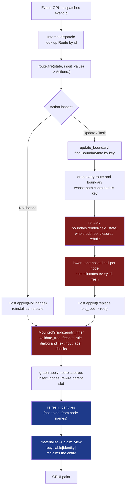
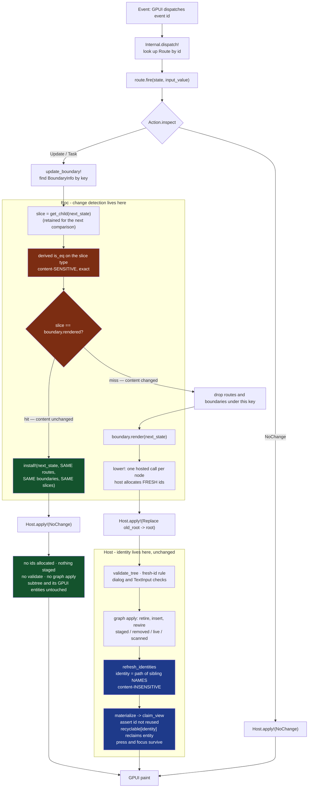

# Incremental render: element identity and content equality

A design, not a change. Nothing in `platform/` or `crates/host/` is modified by
this document. The one piece of code it carries is a prototype,
`wip/prototypes/BoundaryDigest.roc`, which exists to hold down claims a
paragraph cannot and is imported by nothing.

The question posed was whether element identity, which just landed in the GPUI
entity layer, can become load-bearing in the mounted graph so that work becomes
proportional to what changed. The measurements below say it should not, and say
why: **at a `translate` boundary the graph layer is already almost free.** The
cost that remains is Roc-side render and lowering, and the only thing that
removes that cost is not rendering at all. So the scheme proposed here puts a
content comparison in Roc, in front of the render, and spends it on the
`NoChange` patch the ABI already has. The host is not changed at all.

**This document was revised after it was first written.** It originally proposed
a 256-bit BLAKE3 digest, because the builtin `Hasher` is unusable and reference
equality does not exist. Neither of those findings has changed. What changed is
that `is_eq : _` **derives structural equality** for a nominal type — verified
running on `nightly-2026-09-15-fe09c42` for a record containing a `List(Str)` —
which is a better predicate than either: exact, so it cannot report "unchanged"
wrongly, and available today. Section 3.4 now argues that case, and §4 compares
slices rather than digesting them. The measurements in §5 are unaffected: they
are about where the cost is, not how the predicate is computed.

---

## 1. The two mechanisms

They are opposites, and the whole design depends on not conflating them.

| | Identity | Change detection |
|---|---|---|
| Question | "is this the same control?" | "is this the same content?" |
| Sensitivity to content | **must be insensitive** | **must be sensitive** |
| Derived from | path of sibling keys: name, tag, occurrence | the bytes of the state slice |
| Lives in | the host (`bridge.rs`, `element_identities`) | Roc (`BoundaryInfo`) |
| Crosses the ABI | no (computed host-side from staged nodes) | **no** |
| Failure mode | wrong identity loses an in-flight press | collision renders a stale frame |
| Failure character | loud — the press is visibly lost | **silent** |

A button whose caption goes from "Pause" to "Play" is the same control. Its
identity must not move; its equality must. That is the defect fixed in `30b59e3`,
and it is the reason **identity is never derived from a content hash** — a rule
this design does not merely respect but makes structurally impossible to break,
because the comparison never reaches the host.

---

## 2. The flow as it is today



Blue is identity. Red is where the measured time goes. Note where identity
already sits: **after** the rebuild, reclaiming entities for nodes that were
re-staged with brand-new ids. Identity today is a repair applied to a rebuild,
not a way of avoiding one.

The critical structural facts, established by reading:

- `Elem.translate` builds `Boundary(a -> Elem(a))` — a **renderer closure, not
  a tree**. The child slice is not reified anywhere; it is produced lazily by
  `get_child(parent)` on each render.
- `Internal.lower!` makes **one hosted call per node** and the host allocates
  every id (`stage_node`, `next_node_id`). Boundaries are erased from the wire
  entirely; the mounted graph does not know they exist.
- `Host.Patch` is **ids only** — `Mount`, `NoChange`, `Replace{old_root, root}`.
  The node payload was already streamed.
- `Route.fire : (a, Str) => Action(a)` takes state **as an argument**, not
  captured. This is what makes a skip sound; see §4.4.
- Node ids are **never reused**; `apply_inner` enforces it and `materialize`
  asserts it (`crates/host/src/lib.rs:2392`, `"node id {} was reused"`).

---

## 3. What the compiler actually gives us

Established against the pin, `roc nightly-2026-09-12-220fd47`, not by reading
the newer source. Probes are reproducible; the shapes below are quoted from the
compiler's own error output.

### 3.1 `Hasher` — derived, ergonomic, and unusable

`Hasher` is in scope unqualified. `Builtin` is **not** an importable module name
on the pin, which is why `Builtin.Hasher.write_str` reports "does not exist"
while the feature is in fact present. Unqualified, it resolves:

```
Hasher.write_u64   : Hasher, U64      -> Hasher
Hasher.write_str   : Hasher, Str      -> Hasher
Hasher.write_bytes : Hasher, List(U8) -> Hasher
Hasher.write_u8, write_bool, write_dec …  all present
Str.to_hash  : Str,  Hasher -> Hasher
U64.to_hash  : U64,  Hasher -> Hasher
Bool.to_hash : Bool, Hasher -> Hasher
List.to_hash : List(item), Hasher -> Hasher where [item.to_hash : item, Hasher -> Hasher]
```

**`to_hash` is derived.** This was the single most important ergonomic question
and the answer is favourable. All of these check clean on the pin:

- a named record `{ id : U64, label : Str }`
- an anonymous record
- a tag union `[Red, Green, Blue]`
- `List` of record
- nested: `{ n : Dec, m : F64, rows : List({ id : U64, t : Str })}`

And the derivation is **structural and refuses functions**, which is exactly
right: `{ n : U64, go : U64 -> U64 }` has no `to_hash`. That means derivation
cannot be applied to `Elem` (which is closures all the way down) and cannot be
applied to a state record holding a callback — the type system draws the
boundary of applicability for us.

**But there is no way to use it.** `Hasher` is nominal and opaque, and the pin
ships **no constructor and no extractor**. Confirmed absent: `Hasher.empty`,
`.new`, `.default`, `.init`, `.zero`, `.seed`, `.start`, `.from_seed`,
`.complete`, `.finish`, `.state`, `.value`, `.to_u64`; field access `h.state`
("this is not a record"); nominal application `Hasher({state: 0})`; a plain
`{ state : U64 }` (type mismatch against `Hasher`); `Dict.hasher`, `Set.hasher`,
`Str.hasher`, a top-level `hash`, a `Hash` module, `Default.default`.

So on the pin `Hasher` is a **transformer-only surface**: you can write into a
hasher you cannot create and cannot read. It is plumbing for `Dict`/`Set`
internals, not yet a public facility. It is unusable end-to-end today.

### 3.2 `Crypto` — usable, 256-bit, and unergonomic

Both algorithms are present and complete on the pin:

```
Crypto.SHA256.hash         : List(U8)       -> Digest
Crypto.SHA256.hash_chunks  : Iter(List(U8)) -> Digest
Crypto.BLAKE3.hash         : List(U8)       -> Digest
Crypto.BLAKE3.hash_chunks  : Iter(List(U8)) -> Digest
```

`Digest` supports `==`, `.to_bytes()` (32 bytes, verified), is storable in
ordinary state, and is **algorithm-distinct in its type** — a SHA256 digest
cannot be compared to a BLAKE3 one. All verified by running, not just checking.

The cost is the input type. `Crypto` eats `List(U8)`, and the pin has **no
generic structural serializer**: `Inspect.to_str` does not exist, records have
no `.to_str()`. The numeric surface is also thin — `to_ne_bytes`,
`shift_right_zf`, `shr`, `div_trunc` and `List.reverse` are all absent;
`bitwise_and`, `//`, `to_u8_wrap`, `Str.to_utf8` and `Iter.map` exist. So the
byte encoding is **hand-written per type**.

This is the exact inverse of §3.1, and it is the central finding:

> The pin gives us a hash that is derived but has no output, and a digest that
> has an output but must be fed by hand.

`wip/prototypes/BoundaryDigest.roc` writes that encoding for one row type and
passes 8 tests against the pin, including that a caption change moves the
digest, that reordering moves it, and that a length prefix defends the
concatenation boundary (`"ab"` vs `"a"+"b"`). It is kept as evidence for the
claims in this section; §3.4 supersedes it as the proposed mechanism, and the
byte encoding it demonstrates is exactly the work derived `is_eq` removes.

### 3.3 Reference equality — the better mechanism, and unavailable

Roc values are immutable and refcounted, so `{ ..state, frame: n + 1 }` really
does share everything it did not touch, and a pointer comparison on an unchanged
slice would be O(1) and would **fail safe** — it can say "changed" when nothing
did and cost a rebuild, but it can never say "unchanged" wrongly.

It cannot be observed. On the pin there is no `ptr_eq`, no `is_same`, no pointer
accessor on `List` or any other type — probed and absent. And the platform
cannot observe it either: `Internal.lower!` flattens every node to scalars and
`Host.Patch` carries only `u64` ids, so application state never crosses the ABI
as an address at all. There is nothing for the host to compare.

Two further caveats, so this is not oversold if it does arrive:

- It only applies to heap-allocated slices. A boundary whose state slice is a
  `U64` or a small unboxed record has no address to compare, and would always
  report "changed".
- `Elem.lift` performs a total structural rewrite of an already-built tree on
  every render, so sharing is destroyed *downstream* of the boundary. Reference
  equality would have to be taken on the state slice before render, which is
  the same place the comparison goes.

**Recommendation.** Reference equality is the better mechanism and I would take
it over a digest if it existed. It does not. The honest position is: design the
boundary decision as a *predicate* with more than one implementation, and ask
upstream for a `Ref.same : a, a -> Bool` the predicate can switch to without any
other change. §3.4 supersedes the rest of this recommendation: derived `is_eq`
is available today and is exact, so it is what §4 ships, and reference equality
would be a cost optimisation on top rather than a correctness repair.

### 3.4 Derived equality, and why it beats a digest

`is_eq : _` derives structural equality on a nominal type. Verified running on
`nightly-2026-09-15-fe09c42`:

```roc
Row := { id : U64, name : Str, tags : List(Str) }.{
    is_eq : _
    to_hash : _
}
```

`a == b` and `a != c` both hold, including through the `List(Str)`. Derivation
composes over records, tag unions and containers exactly as `to_hash` does, and
refuses function-bearing types for the same reason, so the type system still
draws the applicability boundary.

This is the predicate the scheme should use, and it is strictly better than a
digest on the axis this repository cares about most:

| | cost | failure mode |
|---|---|---|
| reference equality | O(1) | fails safe; **does not exist** |
| **derived `is_eq`** | **O(slice)** | **exact — cannot be wrong** |
| 256-bit digest | O(slice) | collision: silently stale frame |
| 64-bit `Hasher` | O(slice) | collision at ~2 hours of interaction; **unusable anyway** |

A digest's whole risk is that two different slices can compare equal and render
a stale frame that trips no counter, no assertion and no log line. Exact
comparison cannot do that. It costs the same asymptotically — both walk the
slice — and it removes the encoder tax entirely, because there is no byte
encoding to write: no `to_ne_bytes`, no hand-rolled length prefixes, no
`Iter(List(U8))` plumbing, and nothing for an application author to get wrong.

What it trades instead is **memory**: the boundary must retain the previous
slice to compare against, where a digest retains 32 bytes. That is a real cost
and it is the honest objection to this approach — a boundary over a large slice
holds a second copy of it. Two things make it tolerable. Roc values are
immutable and refcounted, so retaining the previous slice retains a reference to
structure the new state mostly shares rather than a deep copy. And the scheme is
opt-in per boundary (§6), so a boundary over a large slice simply does not take
it — which is the same boundary where a digest would have been paying to hash a
large slice anyway.

The residual-risk paragraph this section used to carry is withdrawn. There is no
silent-staleness risk left to state, which also removes the strongest argument
that was being made for reference equality. Reference equality remains better on
cost, and §3.3's recommendation to keep the decision behind one swappable
predicate stands — but it is now an optimisation rather than a correctness
repair, and the scheme no longer waits on it.

---

## 4. The scheme

### 4.1 Where it goes

One sentence: **each `translate` boundary remembers the state slice it last
rendered; on update it compares the new slice with `==`, and if they are equal
it installs the new state and emits the `NoChange` patch that already exists
instead of rendering, lowering, validating and applying.**

What is compared: the **child state slice**, `get_child(next_state)` — not the
element tree, not the parent state, not the rendered nodes. Comparing the
element tree is impossible (closures have no `is_eq`) and would be pointless
anyway, since producing the tree is the cost we are trying to avoid.

Granularity: **one retained slice per `translate` boundary**, which is the
granularity the platform already has. No new seam is introduced.

Where it is stored: in `BoundaryInfo`, Roc-side, beside `render`:

```roc
BoundaryInfo(a) : {
    key : U64, parent : [None, Some(U64)], path : List(U64),
    render : (a -> Elem(a)), root : U64,
    rendered : [Unknown, Known(child)],   # added: the slice last rendered
}
```

The boundary's state slice type must derive `is_eq : _`. That is the opt-in:
a boundary whose slice does not derive it is never skipped, and nothing about
it changes.

Where it is compared: in `update_boundary!`, before `boundary.render(...)`.

What invalidates it: `Unknown` at first lower; replaced on every rebuild; and
discarded implicitly by the existing rule that `update_boundary!` drops every
boundary whose `path` contains the updated key — so an ancestor rebuild already
retires descendant slices along with descendant `BoundaryInfo`.

**The retained slice never crosses the ABI.** The host sees `NoChange` or `Replace`,
exactly as today. This is the property that makes the scheme safe by
construction with respect to everything the constraints name: the never-reused
node id rule and its `materialize` assertion, `validate_tree`, the exact patch
counters (`staged`, `removed`, `live`, `scanned`), and the element identity fix.
None of them are touched, because no host code changes.

### 4.2 The flow as it would be



The crux is the two coloured pairs and the box they each sit in. Orange is the
comparison: **in Roc, before render, sensitive to content, and it never leaves the
`ROC` box.** Blue is identity: **in the host, after apply, derived from sibling
names and blind to content.** They meet nowhere. A caption change moves the
orange value and leaves the blue one exactly where it was, which is precisely
the behaviour `30b59e3` fixed.

### 4.3 Hit and miss

**On a hit**, the boundary emits `NoChange` and installs the new state with the
*same* routes, boundaries and retained slices. This differs from today's `NoChange`
(from `Action.none`) only in that the installed state is the new one. No node
ids are allocated, nothing is staged, `validate_tree` does not run, the graph is
not touched, no node is retired, and therefore no GPUI entity is retired either.

This last point is worth stating in identity terms: **a skip is strictly safer
for identity than a rebuild.** Today a press in flight survives because the
retired entity is reclaimed by identity from `recyclable`. Under a skip the
entity is never retired at all, so there is nothing to reclaim and nothing to
get wrong. The scheme does not merely avoid undermining the identity fix; on the
skip path it makes it unnecessary.

**On a miss**, the path is bit-for-bit what happens today, plus one comparison
computation. Every check, counter and assertion runs unchanged.

### 4.4 Why a skip is sound

Three things have to be true, and all three are properties of the code as it
stands:

1. **Render is a pure function of the slice.** `Program.render : state ->
   Elem(state)`, and a boundary's renderer is `render_child` fixed at
   `translate` time composed with `get_child`. The only varying input is the
   slice. This is sound only if the application's `get_child` is pure and total,
   which the type says but does not prove — a `get_child` that reads a clock
   would break it. That is a documented obligation of `Elem.memo`, not something
   the platform can check.
2. **Routes stay valid.** A skip does not re-lower, so the subtree's node ids do
   not change, so the existing `Route` entries still address live nodes. The
   implementation subtlety is that `update_boundary!` currently drops routes
   under the key unconditionally; the skip path must **not** drop them. This is
   the one place the change is easy to get wrong.
3. **Stale closures are harmless.** `Route.fire : (a, Str) => Action(a)` takes
   state as an argument, and `apply_action!` passes the current state. Handlers
   do not capture the state they were built with, so a handler created for an
   older frame behaves identically. If handlers had captured state, this scheme
   would be unsound and none of the rest would matter.

---

## 5. What it costs

All numbers below are medians from a run of this worktree against the pin, 49/49
specs passing, captures under `.test-out/bench-run/`:

```
python3 scripts/run_specs.py 'benchmarks/rows/specs/*.scm' \
  'benchmarks/row-boundaries/specs/*.scm' \
  --roc ~/roc_nightly-macos_apple_silicon-2026-09-12-220fd47/roc \
  --output .test-out/bench-run
```

`gpui_apply_ns` is NULL in every capture — that stage reported no measurement.
It is unavailable, not zero.

### 5.1 The measurement that reframes the problem

| case (10,000 rows) | cycle | roc cb | validate | graph apply |
|---|---|---|---|---|
| `rows` update every tenth | 24.869 | 15.402 | 3.140 | 5.714 |
| `row-boundaries` update first | 23.610 | 16.056 | 5.564 | **0.0083** |

A row boundary collapses graph apply by **690×**, from 5.714 ms to 8.3 µs — and
the end-to-end cycle does not improve at all (24.9 → 23.6 ms), because Roc
callback and validation dominate and neither falls.

That is the finding that decides the design question posed. **Making identity
load-bearing in the mounted graph would be optimising the stage that a boundary
has already made free.** The 5.7 ms of graph apply in the non-boundary case is
the cost of replacing a 10,000-node root; behind a boundary it is already gone.
What is left is 16 ms of Roc render-and-lower and 5.6 ms of host validation, and
the only way to remove those is to not produce the nodes in the first place.

### 5.2 The ceiling on what a skip can buy — already measured

The `NoChange` path exists today and the suite already measures it, because
`rows` has a `reselect (no change)` case that returns `Action.none`:

| case (10,000 rows) | cycle | roc cb | validate | graph apply |
|---|---|---|---|---|
| `rows` update every tenth | 24.869 | 15.402 | 3.140 | 5.714 |
| `rows` reselect (no change) | **0.824** | 0.618 | ~0 | 0 |

**30× cheaper, end to end.** This is not a projection; it is the same executable
on the same tree taking the `NoChange` path. It is the empirical ceiling for a
skip, minus whatever the comparison itself costs. No modelling required.

### 5.3 Superlinearity, confirmed at the current tip

| `rows` update every tenth | cycle | roc cb | validate | graph apply | alloc |
|---|---|---|---|---|---|
| 10,000 | 24.869 | 15.402 | 3.140 | 5.714 | 126.7 MB |
| 100,000 | 286.752 | 150.965 | 46.339 | 72.919 | 542.4 MB |
| growth for 10× nodes | **11.5×** | 9.8× | **14.8×** | **12.8×** | 4.3× |

Consistent with the backlog entry, which should be updated with these figures
when this work lands rather than continuing to quote the older run.

### 5.4 When the trade loses

Hashing is **pure overhead on a miss**. It is a bet on the hit rate, and there
are two distinct ways to lose it.

**Losing case 1 — a large slice guarding a large rebuild that happens anyway.**
The root boundary of `rows` at 10,000 rows has the whole row list as its slice.
A single row change means comparing 10,000 rows, then rebuilding
everything regardless. Order-of-magnitude: ~10,000 rows × ~32 bytes ≈ 320 KB;
BLAKE3 itself is a fraction of a millisecond at that size, but the encoding
allocates the chunks, and allocation is what this workload is already bad at
(126.7 MB for one 10k update). Call it low single-digit milliseconds against a
24.9 ms cycle — roughly a 10% tax on every miss.

**Losing case 2 — hashing a large slice to skip a small subtree.** This is the
case named in the brief and it is the sharper one. Per-row boundaries make each
slice small, but boundaries are not free: `row-boundaries` at 10,000 rows costs
**185–194 ms** for any collection-wide operation versus **25–31 ms** for plain
`rows` — about **7× worse**, and almost entirely in Roc callback time
(165–173 ms):

| 10,000 rows | `rows` cycle | `row-boundaries` cycle |
|---|---|---|
| select | 26.024 | 185.652 |
| swap | 25.760 | 189.009 |
| delete | 30.816 | 193.721 |
| update every tenth | 24.869 | 185.830 |

The cause is structural: `Elem.lift` is a **total structural rewrite** of an
already-built tree, rebuilding every props record and wrapping every handler,
and nested boundaries stack those wrappers. Ten thousand boundaries means ten
thousand lift traversals. So "put a boundary on every row so each comparison is
small" rides on a mechanism that already costs 165 ms before a single byte is
hashed. **Digests do not rescue fine-grained boundaries; they would be a small
saving on top of a large existing loss.**

The honest summary of the trade:

- **Wins** where a boundary's slice is small relative to its subtree and updates
  frequently leave it untouched — a sidebar, a toolbar, a status panel, a header
  that re-renders because the frame counter moved. These are common and the win
  is the 30× of §5.2.
- **Roughly neutral** at coarse boundaries over large slices with a low hit rate:
  ~10% overhead on misses against occasional 30× savings.
- **Loses** at fine granularity over large collections, because the boundary
  mechanism itself is the dominant cost there and a comparison does not address it.

That third bullet is the important one, and it says the next performance work on
large collections is **not** this scheme — it is `Elem.lift`.

---

## 6. Honest limits

**Established with the compiler.** `to_hash` is derived for records, anonymous
records, tag unions, nested lists-of-records, and refuses function-bearing types
(§3.1). `Hasher` has no constructor and no extractor on the pin and is therefore
unusable end-to-end. `Crypto.SHA256` and `Crypto.BLAKE3` are present, complete,
runnable, 256-bit, algorithm-distinct in the type, and storable in state (§3.2).
No reference-equality or pointer primitive exists (§3.3). The pin's numeric and
serialization surface is thin enough that byte encodings are hand-written.
`wip/prototypes/BoundaryDigest.roc` passes 8 tests demonstrating the encoding
and the skip decision.

**Not established.** (a) The actual throughput of `Crypto.BLAKE3.hash_chunks` on
this workload — §5.4 gives an order of magnitude from first principles, not a
measurement, because measuring it needs the encoding written for a real benchmark
state type, which is a platform change this branch must not land. (b) Whether
the newer compiler that has a public `Hasher` will make a 64-bit path attractive
enough to revisit §3.4 — I do not think so, for the collision reason, but it is
untested. (c) Whether `roc test`'s `expect` timings reflect optimised codegen.

**What would have to be true.** Applications' `get_child` functions must be pure
and total (§4.4). Boundary state slices must derive `is_eq` — no closures in the
slice, which the type system enforces. And the hit rate must be high enough at
the boundaries where it is enabled, which argues strongly that this should be
**opt-in per boundary** (`Elem.memo` alongside `Elem.translate`) rather than
automatic, so an application can put it where it pays and the cost is never
imposed where it does not.

**The regression this used to introduce, withdrawn.** A digest collision would
have rendered a stale frame with nothing to indicate it: no counter moving, no
assertion firing, in a platform where everything else fails loudly. Derived
`is_eq` is exact, so that failure mode does not exist and the mitigation
argument about digest width is moot. What remains is an ordinary bug risk — a
wrong slice compared, or a boundary that skips when its render depends on
something outside its slice — and both fail the same way any logic error does,
which is why the `boundary_skips` counter below still comes first.

**The cost this introduces instead.** A skipping boundary retains its previous
slice. Refcounting means that is a reference to structure the next state mostly
shares rather than a deep copy, but it is not free, and a boundary over a large
slice should not opt in.

**What I would build first**, in order:

1. **A `boundary_skips` counter and a spec gate, before any skipping exists.**
   Make the skip observable and assertable in the same place the existing exact
   patch counters live. A silent optimisation is the thing this repository's
   principles are most against, and §6's regression is exactly why.
2. **A benchmark case that isolates the win.** `benchmarks/rows` already has
   `reselect (no change)` measuring the `NoChange` path. The missing case is a
   state change that provably does not affect a boundary's slice — a frame
   counter incrementing above a static sidebar. That case makes both the 30× win
   and the miss-path tax measurable before the mechanism is designed to a
   conclusion.
3. **The predicate behind one function**, so that §3.3's recommendation can be
   acted on. `boundary_unchanged : slice, slice -> Bool`, derived `is_eq` today,
   `Ref.same` the day it exists.
4. **`Elem.memo`, opt-in**, requiring only that the boundary's slice type derives
   `is_eq : _`. No encoding function, and nothing for an application author to
   write by hand.

And one thing I would **not** build: identity in the mounted graph. §5.1 says
the graph layer at a boundary already costs 8.3 µs. There is nothing there to
win.
